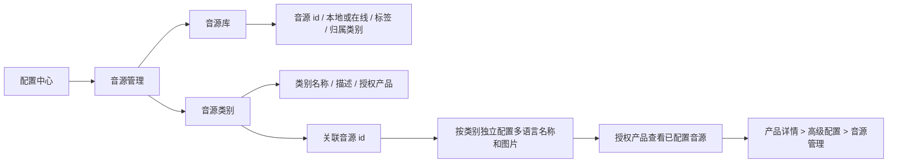
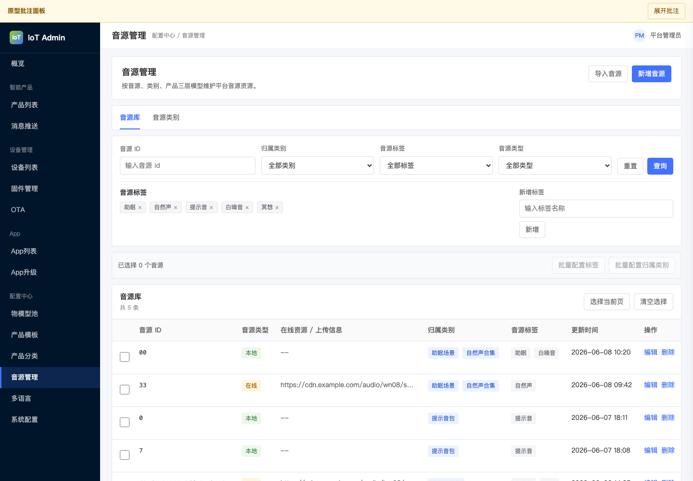
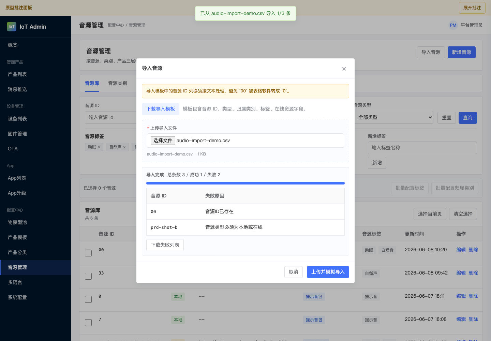
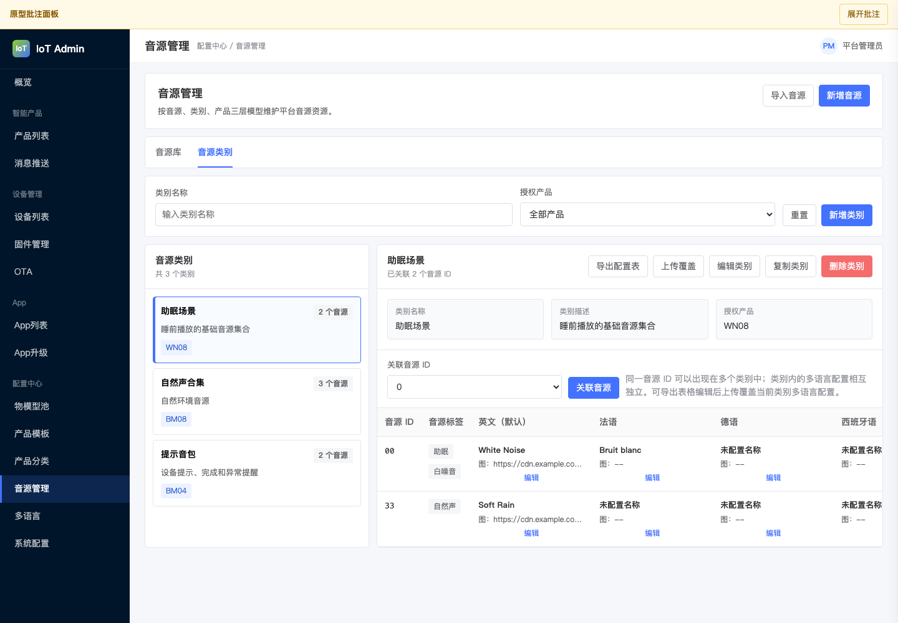
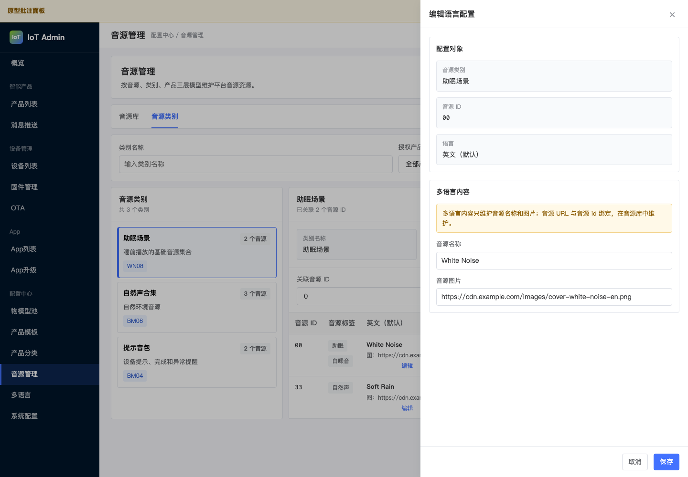
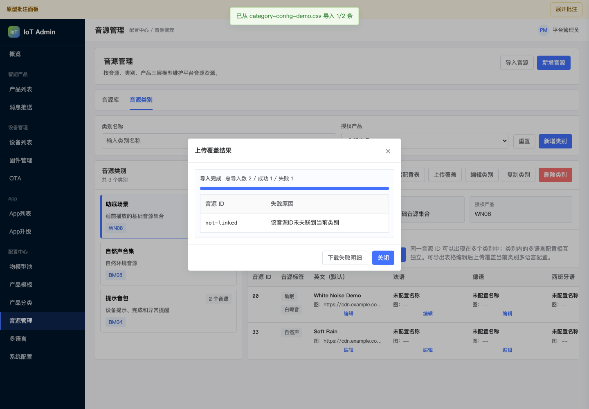
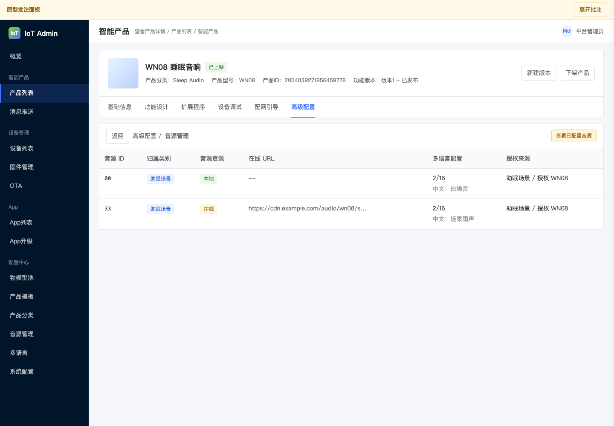

# 平台音源资源池轻量 PRD

Source: [[raw/2026-06-03-platform-audio-resource-pool-request]], [[raw/2026-06-03-platform-audio-resource-pool-clarification]], [[raw/2026-06-03-platform-audio-resource-pool-scope-correction]], [[raw/2026-06-03-platform-audio-resource-pool-page-hierarchy-correction]], [[raw/2026-06-03-platform-audio-resource-pool-locale-preview-correction]], [[raw/2026-06-03-platform-audio-resource-pool-resource-url-upload-correction]], [[raw/2026-06-04-platform-audio-resource-pool-category-language-update]], [[raw/2026-06-08-platform-audio-resource-pool-prototype-annotations]], [[raw/2026-06-08-platform-audio-resource-pool-required-fields-comment]], [[raw/2026-06-08-platform-audio-resource-pool-category-filter-comment]], [[raw/2026-06-08-platform-audio-resource-pool-language-specific-category]], [[raw/2026-06-08-platform-audio-resource-pool-three-layer-model]], [[AIoT-Platform/platform-audio-resource-pool/context]], [[AIoT-Platform/platform-audio-resource-pool/attack-register]], [[AIoT-Platform/platform-audio-resource-pool/decision-log]], [[AIoT-Platform/platform-audio-resource-pool/prototype-contract]], [[AIoT-Platform/device-assistant-cloud-config/PRD]], [[wiki/luteos-iot-admin-full-view/IoT智能产品]], [[wiki/luteos-iot-admin-full-view/IoT多语言配置]], [[wiki/luteos-iot-admin-full-view/iot-admin-UI设计规范|iot-admin-UI设计规范]]

原型地址：https://hawzz.github.io/PRD-platform-audio-resource-pool/

## 1. 背景与目标

平台需要将音源从单一产品配置中抽离为三层管理模型：`音源 -- 类别 -- 产品`。配置中心统一维护音源库和音源类别，产品详情高级配置只查看当前产品已授权 / 已配置的音源资源，避免在每个产品下重复录入基础音源数据。

目标：

- 在 `配置中心 > 音源管理` 新增统一入口。
- 支持音源库新增音源、导入本地音源、查询、删除、标签管理和批量配置。
- 支持音源类别独立增删改查、授权产品、关联音源 id、多语言内容配置和类别复制。
- 类别下的同 id 音源配置互相独立，不影响其他类别。
- 产品详情高级配置中的音源管理改为查看当前产品已配置资源，不承担主维护入口。
- 保持 `resource_id` 按 string 存储、展示和传输，长度 1～32 位，`00` 不等于 `0`。
- 在线音源的 URL / 上传文件能力由技术方案确定。

## 2. 信息架构

### 入口

| 入口 | 定位 |
| --- | --- |
| `配置中心 > 音源管理` | 音源库、音源类别和多语言配置的主维护入口 |
| `产品详情 > 高级配置 > 音源管理` | 查看当前产品已配置的音源资源，包括音源 id、资源类型 / URL、多语言配置 |

## 3. 用户角色

| 角色 | 说明 |
| --- | --- |
| IoT 平台管理员 | 维护音源库、音源类别、标签和多语言内容 |
| 业务线产品经理 | 确认设备音源 id、类别授权产品和上线后资源补齐 |
| 后端 / 技术方案负责人 | 设计音源上传 / URL、对外服务接口、索引和权限 |
| 测试人员 | 验证字符串 id、类别独立、多语言配置、批量操作和删除确认 |

## 4. 用户故事 / JTBD

1. 作为 IoT 平台管理员，我想在配置中心统一新增音源和导入本地音源，以便多个产品或类别复用同一音源 id。
2. 作为 IoT 平台管理员，我想独立维护音源类别，并为类别授权产品，以便产品只查看可用类别下的音源。
3. 作为 IoT 平台管理员，我想在类别下配置音源 id 的多语言名称和图片，以便同一个音源 id 在不同类别下可以有不同展示配置。
4. 作为 IoT 平台管理员，我想批量配置音源标签和归属类别，以便快速整理大量音源。
5. 作为业务线产品经理，我想在产品详情中查看已配置音源，以便确认当前产品最终可用的音源清单。

## 5. 需求范围

纳入范围：

- `配置中心 > 音源管理` 菜单入口。
- 音源库：查询、新增音源、导入本地音源、删除、标签管理、批量配置标签、批量配置归属类别。
- 音源类别：增删改查、授权产品、关联音源 id、多语言音源配置、复制类别。
- 产品详情高级配置：查看当前产品已配置音源资源。
- 资源 id 字符串规则和删除二次确认。

不纳入范围：

- 不定义真实音频上传、转码、CDN、鉴权和播放协议。
- 不固化对外接口入参、出参、匹配策略和错误码。
- 不处理用户侧收藏、播放历史、歌单排序和推荐算法。
- 不把音源类别扩展为全媒体资产分类中心。
- 不把上线后初始资源补齐作为后台功能状态或筛选项。

## 6. 功能需求

### 6.1 音源库

| 编号 | 需求 |
| --- | --- |
| FR-1 | 在 `配置中心 > 音源管理` 中提供音源库列表。 |
| FR-2 | 支持查询音源 ID、音源归属类别、音源标签；音源标签筛选支持“无标签”。 |
| FR-3 | 支持新增音源，音源 id 必填，长度 1～32 位，按 string 保存。 |
| FR-4 | 支持导入本地音源；平台提供导入模板下载和导入文件上传，不通过文本框手工输入 CSV 内容。在线音源因无法通过导入配置音源文件，必须手动新增并上传 / 维护资源文件。 |
| FR-4A | 导入模板中的音源 id 必须按文本处理，导入模板表头使用中文展示；模板字段包含音源 ID、归属类别、音源标签，不包含音源类型和在线资源 URL。 |
| FR-4B | 导入时必须校验必填项：音源 ID；导入成功的音源统一创建为本地音源。 |
| FR-4C | 导入时必须校验音源 ID 是否重复，包含与现有音源重复和导入文件内重复。 |
| FR-4D | 导入仅支持本地音源；若上传文件兼容旧模板并包含音源类型字段，类型为空或本地时按本地处理，类型为在线或其他值时导入失败并提示在线音源需手动新增。 |
| FR-4E | 导入时必须校验归属类别是否存在，不支持在导入时新增类别；多类别使用英文逗号分隔。 |
| FR-4F | 导入时必须校验音源标签是否存在，不支持在导入时新增标签；多标签使用英文逗号分隔。 |
| FR-4G | 导入完成后展示总条数、成功数、失败数，失败列表包含失败原因，并支持下载失败列表。 |
| FR-5 | 音源资源为必填项，音源类型支持本地 / 在线。 |
| FR-6 | 本地音源不要求 URL 或音频文件信息。 |
| FR-7 | 在线音源需要维护 URL 或上传文件信息，具体控件和处理流程由技术方案确定。 |
| FR-8 | 新增音源或导入本地音源时可设置一个或多个音源归属类别，选填。 |
| FR-9 | 新增音源或导入本地音源时可设置音源标签，选填。 |
| FR-10 | 音源标签采用轻量化管理模式，支持新增、删除和选择。 |
| FR-11 | 支持批量配置音源标签。 |
| FR-12 | 支持批量配置一个或多个音源归属类别。 |
| FR-13 | 批量配置音源标签和批量配置音源归属类别是两个独立操作，无关联。 |
| FR-14 | 支持删除音源，删除前必须进行二次确认。 |

原型关联：

| 关联 FR                     | 原型位置                | 截图                                                                   |
| ------------------------- | ------------------- | -------------------------------------------------------------------- |
| FR-1、FR-2、FR-3、FR-5～FR-14 | `配置中心 > 音源管理 > 音源库` |        |
| FR-4～FR-4G                | `音源库 > 导入音源` 弹窗     |  |

### 6.2 音源类别

| 编号 | 需求 |
| --- | --- |
| FR-15 | 音源类别支持独立管理列表，用户可以新增、编辑、删除和查询。 |
| FR-16 | 音源类别字段包含类别名称、类别描述、授权产品。 |
| FR-17 | 类别名称必填。 |
| FR-18 | 类别描述选填。 |
| FR-19 | 授权产品选填。 |
| FR-19A | 类别授权产品互斥：某产品授权给一个音源类别后，其他音源类别不可再选择该产品。 |
| FR-20 | 类别支持关联音源 id；同一音源 id 可以关联到多个类别。 |
| FR-20A | 类别详情支持对已关联音源 id 进行单个解除关联；解除后仅移除当前类别与该音源 id 的关联及当前类别下该 id 的多语言配置，不删除音源库中的音源。 |
| FR-21 | 类别关联音源 id 后，可对该类别下的音源设置多语言音源名称和音源图片；音源 URL 按音源 id 在音源库维护。 |
| FR-22 | 类别下的音源配置不会影响其他类别同 id 的音源配置，配置按类别独立。 |
| FR-23 | 音源类别支持复制。复制内容包括类别名称、类别描述、关联 id、音源多语言配置。 |
| FR-24 | 复制后的类别名称自动增加后缀“ 副本”。 |

原型关联：

| 关联 FR       | 原型位置                 | 截图                                                             |
| ----------- | -------------------- | -------------------------------------------------------------- |
| FR-15～FR-24、FR-20A | `配置中心 > 音源管理 > 音源类别` |  |

### 6.3 类别多语言配置表

| 编号 | 需求 |
| --- | --- |
| FR-25 | 类别下的音源多语言配置使用表格呈现。 |
| FR-26 | 表格列依次包含音源 id、音源标签、语言列。 |
| FR-27 | 每个语言列包含该语言下的音源名称和音源图片；音源 URL 与音源 id 绑定，在音源库中维护，不作为多语言配置。 |
| FR-28 | 支持对某个音源 id 的具体语言独立编辑。 |
| FR-29 | 同一音源 id 在不同类别中的多语言配置相互独立。 |
| FR-30 | 任一音源 id 的任一语言未同时完成音源名称和音源图片配置时，认为该音源 id 的该语言未配置，默认回传英文资源；具体接口表达由技术方案确定。 |
| FR-30A | 支持导出当前类别关联的音源 id 列表和多语言音源名称配置表；导出文件表头使用中文展示。 |
| FR-30B | 支持上传编辑后的配置表，按当前类别和同音源 id 覆盖多语言音源名称配置。 |
| FR-30C | 导出配置表和上传覆盖文件仅涉及各语言音源名称；音源图片不在配置表中维护，只能在 Web 单条语言编辑界面配置，具体上传控件由技术方案确定。 |
| FR-30D | 批量上传覆盖过程需要展示导入进度。 |
| FR-30E | 批量上传覆盖完成后需要通过结果弹窗展示总导入数、成功数、失败数，并列出失败项和失败原因，不直接插入类别详情页面内容区。 |
| FR-30F | 批量上传覆盖失败明细支持下载。 |
| FR-30G | 类别配置导出表和上传覆盖文件表头不包含 `{语言}音源URL` 或 `{语言}图片URL`；上传覆盖不维护音源 URL 或音源图片。 |

原型关联：

| 关联 FR                                 | 原型位置                 | 截图                                                                        |
| ------------------------------------- | -------------------- | ------------------------------------------------------------------------- |
| FR-25～FR-27、FR-29、FR-30、FR-30A、FR-30G | `音源类别 > 类别详情配置表`     |             |
| FR-28                                 | `音源类别 > 语言列 > 编辑` 抽屉 |       |
| FR-30B～FR-30F                         | `音源类别 > 上传覆盖` 结果弹窗   |  |

说明：

- 在三层模型下，语言维度用于配置“类别下关联音源”的名称和图片，不用于在同一个表单内重复创建全局类别实体。
- 音源类别本身通过 `配置中心 > 音源管理 > 音源类别` 独立管理；若后续要求类别名称或类别描述也支持多语言，需要补充类别字段规则。
- 若某类别关联了音源 id `00`，用户需要分别维护该类别下 `00` 在不同语言中的音源名称和图片；任一语言未同时具备名称和图片时，该语言视为未配置并默认回传英文资源。
- 类别配置导出 / 上传覆盖只维护各语言音源名称；音源图片通过 Web 单条语言编辑界面配置。

### 6.4 产品详情音源查看

| 编号 | 需求 |
| --- | --- |
| FR-31 | 现有 `产品详情 > 高级配置 > 音源管理` 保留为产品维度查看页。 |
| FR-32 | 产品详情页展示当前产品已配置音源资源。 |
| FR-33 | 展示字段包括音源 id、音源资源类型、本地 / 在线、在线 URL、多语言配置完整度。 |
| FR-34 | 产品详情页不作为新增 / 导入音源和维护类别的主入口。 |

原型关联：

| 关联 FR       | 原型位置                 | 截图                                                             |
| ----------- | -------------------- | -------------------------------------------------------------- |
| FR-31～FR-34 | `产品详情 > 高级配置 > 音源管理` |  |

### 6.5 字符串 id 规则

| 编号 | 需求 |
| --- | --- |
| FR-35 | 音源 id 在前端表单、导入模板、数据库、日志和对外传输中均按 string 处理。 |
| FR-36 | 系统不得将音源 id 转为 number，不得执行 `parseInt`、数值格式化或前导零归一。 |
| FR-37 | `00` 与 `0` 是两个不同音源 id。 |
| FR-38 | 音源 id 长度为 1～32 位。 |

原型关联：

| 关联 FR       | 原型位置                                | 截图                                                                   |
| ----------- | ----------------------------------- | -------------------------------------------------------------------- |
| FR-35～FR-38 | `配置中心 > 音源管理 > 音源库`、`音源库 > 导入音源` 弹窗 |  |

## 7. 验收标准

- `配置中心` 下存在“音源管理”入口。
- 音源库支持新增音源和导入本地音源，并能查询音源 ID、归属类别和标签。
- 音源标签筛选支持筛选无标签音源。
- 导入音源提供模板下载和文件上传入口，不要求用户在页面中手工输入 CSV 文本；模板表头使用中文，且不包含音源类型和在线资源 URL。
- 导入音源仅支持本地音源，校验必填项、重复 ID、类别、标签；如上传文件包含在线音源类型，导入失败并提示在线音源需手动新增；导入结果展示总条数 / 成功数 / 失败数、失败原因，并支持下载失败列表。
- 新增音源时，音源 id 长度 1～32 位且按 string 保存。
- 新增 / 编辑音源时音源资源必填。
- 在线音源未维护 URL 或上传文件信息时，系统按技术方案规则进行拦截或提示。
- 音源标签支持轻量新增、删除、选择和批量配置。
- 批量配置标签和批量配置归属类别是两个独立操作。
- 删除音源需要二次确认。
- 音源类别支持增删改查、授权产品和关联音源 id。
- 类别详情支持对已关联音源 id 进行单个解除关联，解除后不删除音源库中的音源本体。
- 某产品授权给一个音源类别后，其他类别不可再选择该产品。
- 类别下同 id 音源的多语言配置不影响其他类别。
- 任一音源 id 的任一语言未同时完成音源名称和音源图片配置时，该语言视为未配置并默认回传英文资源。
- 类别详情支持导出关联 id 和多语言音源名称配置表，导出表头使用中文。
- 类别配置表上传覆盖时，只维护多语言音源名称，不包含 `{语言}音源URL` 或 `{语言}图片URL` 字段；音源 URL 在音源库中按音源 id 管理，音源图片在 Web 单条语言编辑界面配置。
- 类别配置表上传覆盖过程和结果通过弹窗展示，包含进度、总导入数 / 成功数 / 失败数、失败原因，并支持下载失败明细。
- 复制类别会复制类别描述、关联 id 和多语言配置，并将类别名称加后缀“ 副本”。
- 产品详情高级配置音源管理页只查看当前产品已配置音源资源。

## 8. 测试用例

| 用例 | 前置条件 | 操作 | 预期 |
| --- | --- | --- | --- |
| TC-1 菜单入口 | 用户有配置中心权限 | 进入配置中心 | 展示“音源管理”入口 |
| TC-2 新增本地音源 | 进入音源库 | 输入 id `00`，选择本地，保存 | 保存成功，列表显示 `00` |
| TC-3 标签筛选无标签 | 存在无标签音源 | 音源标签筛选选择“无标签” | 列表只展示无标签音源 |
| TC-4 导入音源模板 | 进入音源库 | 点击导入音源并下载模板 | 模板表头为中文，包含音源 ID、归属类别、音源标签；展示导入模板下载和导入文件上传，不展示 CSV 文本输入框，不包含音源类型和在线资源 URL |
| TC-5 导入本地音源成功 | 导入文件中的 id 不重复，类别 / 标签均有效 | 上传导入文件 | 结果展示总条数、成功数、失败数；成功项以本地音源进入音源库 |
| TC-6 导入音源失败 | 导入文件存在重复 id、在线音源类型、错误类别或错误标签 | 上传导入文件 | 失败列表展示失败原因，并支持下载；在线音源提示需手动新增并上传 / 维护资源文件 |
| TC-7 在线音源校验 | 进入新增音源 | 选择在线但不填 URL / 上传信息 | 系统拦截或提示需维护在线音源资源 |
| TC-8 标签轻量管理 | 进入音源库 | 新增标签 `睡眠` 并选择到音源 | 标签可保存并用于查询 |
| TC-9 批量配置标签 | 勾选多个音源 | 批量设置标签 | 多个音源标签被更新 |
| TC-10 批量配置类别 | 勾选多个音源 | 批量设置归属类别 | 多个音源归属类别被更新，且不影响标签 |
| TC-11 删除二次确认 | 音源存在 | 点击删除并完成两次确认 | 音源被删除；未完成二次确认时不删除 |
| TC-12 类别新增 | 进入音源类别 | 新增类别名称、描述、授权产品 | 类别创建成功 |
| TC-13 授权产品互斥 | 产品 WN08 已授权给 A 类别 | 新增 / 编辑 B 类别 | WN08 不可选择 |
| TC-14 类别多语言配置 | 类别已关联音源 id | 编辑某 id 的英文名称和图片 | 仅该类别下该 id 的英文配置被更新 |
| TC-14A 解除关联音源 | 类别已关联音源 id `00` | 点击 `00` 所在行的解除关联 | 当前类别不再关联 `00`，音源库中的 `00` 不被删除，其他类别下 `00` 的配置不受影响 |
| TC-15 类别配置导出 | 类别已关联音源 id | 点击导出配置表 | 导出表包含关联 id、音源标签和各语言音源名称列，且表头为中文；不包含 `{语言}音源URL` 或 `{语言}图片URL` |
| TC-16 类别配置上传覆盖成功 | 已下载并编辑配置表中的语言名称 | 上传配置表 | 通过结果弹窗展示导入进度；当前类别下同 id 的多语言名称被覆盖，原有图片配置不被配置表覆盖；结果展示总导入数、成功数、失败数 |
| TC-17 类别配置上传覆盖失败 | 配置表中存在缺少音源 id 或未关联到当前类别的音源 id | 上传配置表 | 结果弹窗展示失败项、失败原因，并可下载失败明细 |
| TC-18 类别配置独立 | A 类别和 B 类别都关联 id `00` | 修改 A 类别 id `00` 的中文名称 | B 类别 id `00` 中文名称不受影响 |
| TC-19 复制类别 | 类别存在多语言配置 | 点击复制类别 | 新类别名称加“ 副本”，描述、关联 id 和多语言配置被复制 |
| TC-20 产品详情查看 | 产品已授权类别 | 进入产品详情高级配置音源管理 | 展示音源 id、资源类型 / URL 和多语言配置 |

## 9. 风险与依赖

- 在线音源 URL / 上传文件、文件校验、存储、CDN 和鉴权依赖技术方案。
- 删除音源可能影响已授权类别和产品查看，需技术方案确认删除保护或引用提示。
- 批量配置标签和归属类别需要明确覆盖、追加或清空策略。
- 类别复制涉及大量多语言配置，需关注复制后的维护成本和权限控制。
- 产品详情查看页与配置中心音源管理的数据同步时机需由技术方案确认。
